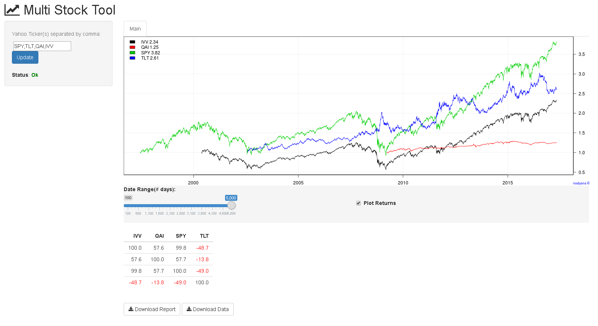

# MultiStocks
bench-marking  multi stocks using R shiny

## How-To
1. Run Shiny to RStudio.
  * Install shiny package in your RStudio.
  ```R
  install.packages("shiny")
  ```
  * create ui.R for frontend and server.R for backend, or you can create single file name app.R with server and ui codes inside.
  * run app, and it will launch localhost on browser automatically.
2. Run Shiny on your server.
  * [https://www.rstudio.com/products/shiny/download-server/](https://www.rstudio.com/products/shiny/download-server/)
  * [https://www.digitalocean.com/community/tutorials/how-to-set-up-shiny-server-on-ubuntu-14-04](https://www.digitalocean.com/community/tutorials/how-to-set-up-shiny-server-on-ubuntu-14-04) 

## Screenshoot

